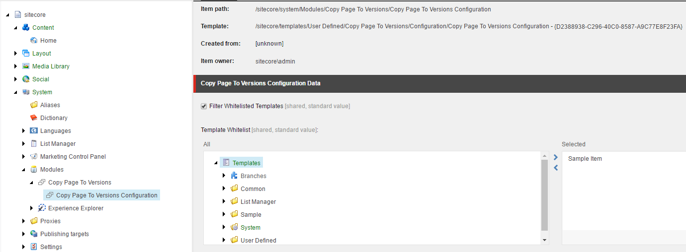
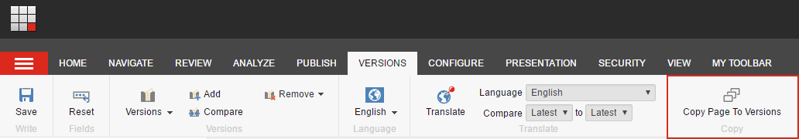
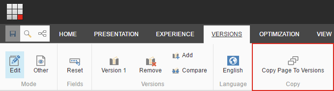
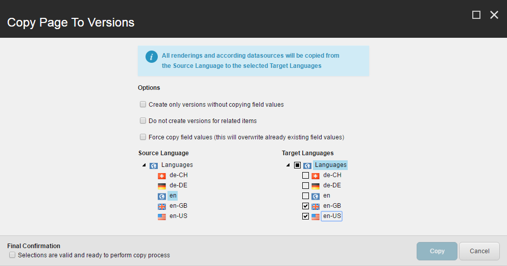

# SitecoreCopyPageToVersions

1. [Management Summary](#management-summary)
2. [Installation](#installation)
    * [Via item package](#via-item-package)
    * [Via NuGet package](#via-nuget-package)
3. [Assembly references and dependencies](#assembly-references-and-dependencies)
4. [Configuration](#configuration)
5. [Usage](#usage)
    * [Copy Page To Versions Dialog](#copy-page-to-versions-dialog)
6. [Dependent items and components](#dependent-items-and-components)
    * [Sitecore Items](#sitecore-items)
    * [Code Files](#code-files)
7. [Security](#security)
8. [Performance](#performance)

## Management Summary

_Copy Page To Versions_ is an extension for the Content Editor and the Experience Editor. It provides a dialog for content editors, where a page in a specific version can be copied to a selectable list of language versions. This includes all datasources referenced on the page renderings. 

The Current version is tested on Sitecore 9.0.1

## Installation

The module is available as Sitecore package for the Package Installer or as NuGet package.

### Via item package

To install _Copy Page To Versions_ perform the following steps:
* Download the Sitecore installation package from [Namics.Common.Packages.CopyPageToVersions/Files/Sitecore_Packages/SitecoreCopyPageToVersions_Sitecore_9plus_V-1.1.zip](Namics.Common.Packages.CopyPageToVersions/Files/Sitecore_Packages/SitecoreCopyPageToVersions_Sitecore_9plus_V-1.1.zip)
* Install the downloaded package via Sitecore's _Installation Wizard_

The package ships with:
* Sitecore items (for further information see section _Dependent items and components)
* Namics.Common.Packages.CopyPageToVersions.config
* JavaScript files for the speak dialog (for further information see section _Dependent items and components)
* Binary Namics.Common.Packages.CopyPageToVersions.dll

If you only need the Sitecore items there you can also just install the following package:
* [Namics.Common.Packages.CopyPageToVersions/Files/Sitecore_Packages/SitecoreCopyPageToVersions_Sitecore_9plus_V-1.1_Items_Only.zip](Namics.Common.Packages.CopyPageToVersions/Files/Sitecore_Packages/SitecoreCopyPageToVersions_Sitecore_9plus_V-1.1_Items_Only.zip)

### Via NuGet package

* Install the Nuget Package 'Namics.Common.Packages.CopyPageToVersions.Sc90' from https://www.nuget.org on your desired Sitecore Helix Foundation moule. 
* If necessary, consolidate Newtonsoft.Json version with your other projects in the Solution, preferably v10.0.3
* If you use Unicorn...
    * Enable the example serialization config file, by changing removing the .example extension and adapt it to your needs: [Namics.Common.Packages.CopyPageToVersions.Serialization.config.example](Namics.Common.Packages.CopyPageToVersions/App_Config/Include/zCustom/Foundation/CopyPageToVersions/Namics.Common.Packages.CopyPageToVersions.Serialization.config.example)
    * Find the serialized yml files under [Namics.Common.Packages.CopyPageToVersions/Files/Unicorn](Namics.Common.Packages.CopyPageToVersions/Files/Unicorn)
    * Copy the serialized files to your solutions serialization location
* If you don't use Unicorn, use the items only package for installation on your environments: [Namics.Common.Packages.CopyPageToVersions/Files/Sitecore_Packages/SitecoreCopyPageToVersions_Sitecore_9plus_V-1.1_Items_Only.zip](Namics.Common.Packages.CopyPageToVersions/Files/Sitecore_Packages/SitecoreCopyPageToVersions_Sitecore_9plus_V-1.1_Items_Only.zip)

## Assembly references and dependencies
All assemblies referenced by _Namics.Common.Packages.CopyPageToVersions.dll_, are shiped with a common Sitecore installation.
The assembly is compiled against the following assembly references:

| Assembly  | Version  |
|---|---|
| Newtonsoft.Json  | 10.0.3  |
| Sitecore.Kernel  | 11.1.0.0  |
| Sitecore.Mvc  | 2.1.0.0  |
| Sitecore.Speak.Applications  | 2.1.0.0  |
| Sitecore.Speak.Client  | 3.1.0.0  |
| System.Web.Http.WebHost  | 5.2.3.0  |
| System.Web.Mvc  | 5.2.3.0  |

## Configuration
The whitelisting of translatable templates is taken from the "Copy Page To Versions Configuration" under _/sitecore/system/Modules/Copy Page To Versions/Copy Page To Versions Configuration_.

| Field Name  | Field Type  | Description  | 
|---|---|---|
| Filter Whitelisted Templates  | Checkbox  | Choose whether to filter/include the selected templates for the item creation, or not.  |
| Template Whitelist  | Treelist  | Only the selected templates are included for the version creation, if the "Filter Whitelisted Templates"-Checkbox is checked.  |

## Usage
A user is able to copy a page in a specific version to a selectable list of language versions form experience editor and content editor. Therefore open the Copy Page To Versions dialog via the provided buttons:

In the content editor, the button is only enabled, if the selected item is a content item and has a defined layout.

### Copy Page To Versions Dialog

| Dialog Input  | Description  |
|---|---|
| Create only versions without copying field values  | If this checkbox is selected, only the language versions of all related page items get created and the final renderings are merged to the target language versions. This can be useful, if you only want to create all page related item versions without field values, i.e. manual translation from English to German, where you don't want the english content on the german versions.  |
| Do not create versions for related items  | If checked, only the langage versions of the page item get created and the final renderings get copied to the target language versions. This can be useful, if you only want to create page versions and copy the final renderings.  |
| Force copy field values (this will overwrite already existing field values)  | If checked, all field values are getting overwritten with the source language field values. This means, if a version of a selected target language already exists, with different/modified field values, they got lost. Default behaviour is, that fields, with already exitsting content are not getting overwritten. Only use this flag, if you're absolutely sure that you'll overwrite existing versions with the field values from the source lanugage.  |
| Source Language  | Source Language of the translation. The current language of the page in the Experience Editor is selected per default. If you manually change it, make sure, the current page in this source language exists.  |
| Target Language  | Target Languages of the translation. If the Languages root is selected, the translation will be requested for all languages (except source language).   |
| Final Confirmation  | This flag needs to be set as final confirmation, that the Copy-Button gets enabled  |

## Dependent items and components
### Sitecore Items
The following Sitecore items are needed

| Database  | Item  | Description   |
|---|---|----|
| core  | /sitecore/client/Applications/Dialogs/CopyPageToVersionsDialog*  | The dialog  | 
| core  | /sitecore/client/Applications/ExperienceEditor/Pipelines/User Defined/CopyPageToVersions*  | The dialog pipelines   |
| core  | /sitecore/client/Business Component Library/version 1/Layouts/Renderings/Resources/Rule/Rules/Actions/CopyPageToVersions  | The rule action for the copy button   |
| core  | /sitecore/content/Applications/WebEdit/Ribbons/WebEdit/Versions/Copy*  | The webedit ribbon button for the experience editor   |
| core  | /sitecore/content/Applications/Content Editor/Ribbons/Chunks/Copy Page To Versions Chunk*   /sitecore/content/Applications/Content Editor/Ribbons/Strips/Versions/Copy*  | The custom chunk and button in the versions ribbon in content editor   |
| master  | /sitecore/system/Modules/Copy Page To Versions  | The configuration item for the template whitelisting   |
| master  | /sitecore/templates/User Defined/Copy Page To Versions  | The template for the configuration   |

### Code Files
The following JavaScript files are needed for the dialog

| Name  | Path  | Description   |
|---|---|----|
| CopyPageToVersions.js  | \sitecore modules\Web\CopyPageToVersions\Commands\CopyPageToVersions.js  | Handles the button command. Defines canExecute and executes the CopyPageToVersionsPipeline   |
| CopyPageToVersionsDialog.js  | \sitecore modules\Web\CopyPageToVersions\Dialogs\CopyPageToVersionsDialog.js  | Dialog JS tho handle events in the dialog. i.e. checking a selection and show message bar   |
| CopyPageToVersions.OpenDialog.js  | \sitecore modules\Web\CopyPageToVersions\Pipelines\CopyPageToVersions.OpenDialog.js  | Pipeline JS which opens the dialog   |
| CopyPageToVersions.js  | \sitecore\shell\client\Speak\Layouts\Renderings\Resources\Rules\ConditionsAndActions\Actions\CopyPageToVersions.js  | Rule Action which is registered on the Copy-Button. Handles the dialog submission and calls the CopyPageToVersionsController with the submission data   |

## Security
CopyPageToVersionsController checks if a user is authenticated and only runs the processor if current context is master. 

## Performance
The copy process runs in a pipeline context. To copy an average page to 10 languages takes about 500ms
Information about the elapsed time during a copy process can be viewed in the logfile, i.e. "CopyPageToVersionsProcessor: ended in 00:00:00.5277924"
